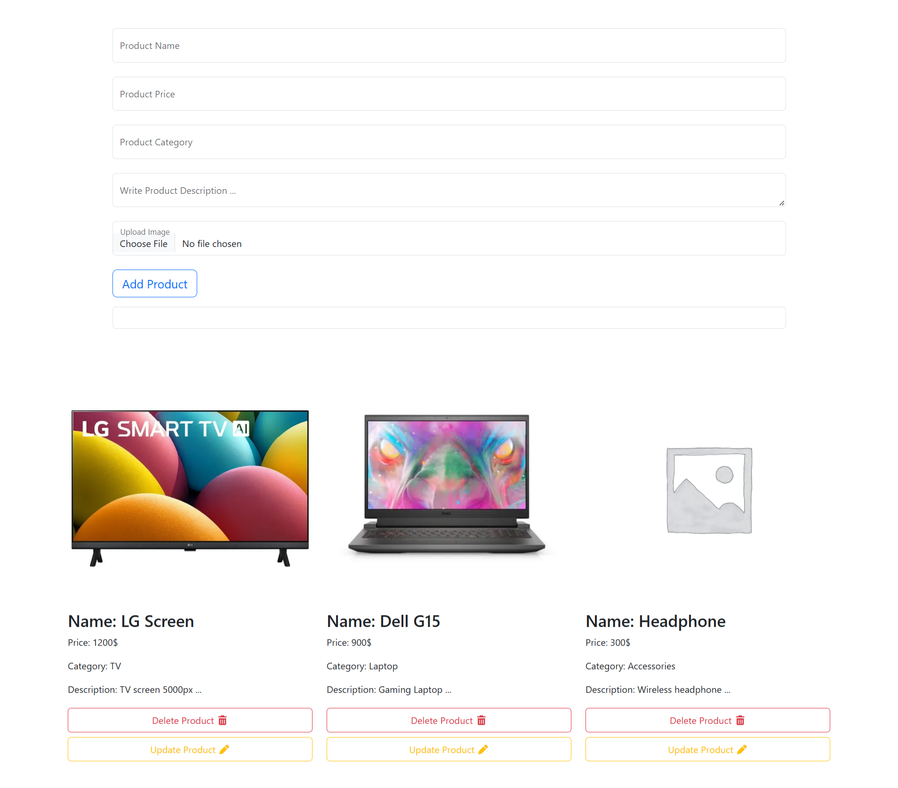

# Learning CRUD with Vanilla JavaScript

A simple product management project built while learning and practicing CRUD operations using Vanilla JavaScript.

The project focuses on understanding how to Create, Read, Update, Delete, and Search data through practical implementation.

## Project Preview

## CRUD Operations

- **Create** — Add new products to the product list.
- **Read** — Display and retrieve stored products.
- **Update** — Edit the data of an existing product.
- **Delete** — Remove products from the product list.

## Features

- Add new products with their details and image.
- Display all saved products.
- Update existing product information.
- Delete products from the list.
- Search for products by name.
- Update and delete products while searching.
- Validate user inputs using Regular Expressions.
- Show validation feedback using Bootstrap validation states.
- Store product data using localStorage.
- Keep product data after reloading the page.
- Use a placeholder image when no product image is selected.

## Technologies Used

- HTML5
- CSS3
- Bootstrap 5
- JavaScript (Vanilla JS)
- Font Awesome

## What I Learned

Through this project, I practiced and improved my understanding of:

- Implementing CRUD operations with JavaScript.
- Working with arrays and objects to manage application data.
- Manipulating the DOM to display and update content dynamically.
- Using localStorage to persist data between page reloads.
- Validating user input with Regular Expressions.
- Searching and filtering products.
- Handling indexes correctly when updating or deleting filtered products.
- Switching between Add Mode and Update Mode.
- Organizing JavaScript logic into reusable functions.

